# **_Afterlife_**

Afterlife is a local up and coming rock band from Limerick city. The site is aimed at people interested in local acts and live music. A focus of the site is to market a new album about to drop and the following tour.

Welcome to the journey through <a href="https://gallie83.github.io/PP1-HTML-CSS/" target="_blank" rel="noopener">Afterlife</a>

# Contents

* [**User Experience UX**](<#user-experience-ux>)
    *  [User Stories](<#user-stories>)
    * [Wireframes](<#wireframes>)
    * [Site Structure](<#site-structure>)
    * [Design Choices](<#design-choices>)
    *  [Typography](<#typography>)
    *  [Colour Scheme](<#colour-scheme>)
* [**Features**](<#features>)
    * [**Home**](<#navigation-menu>)
         * [Navigation menu](<#navigation-menu>)
           * [Home Image](<#home-image>)
         * [Our Background](<#Our-background>)
         * [Footer](<#footer>)
         * [Tour](<#tour>)
         * [Album](<#album>)
         * [Merch](<#merch>)
         * [Contact](<#contact>)
         * [Submit page](<#submit-page>)
    * [**Future Features**](<#future-features>)
* [**Technologies Used**](<#technologies-used>)
* [**Testing**](<#testing>)
* [**Deployment**](<#deployment>)
* [**Credits**](<#credits>)
    * [**Content**](<#content>)
    * [**Media**](<#media>)
*  [**Acknowledgements**](<#acknowledgements>)

# User Experience (UX)

## User Stories

* As a user I want to be able to navigate through the whole site smoothly.
* As a user I want to understand the purpose of the site upon loading it.
* As a user I want to easily be able to contact Afterlife for more information.
* As a user I want to see all of Afterlife's body of work.
* As a user I want to know more about Afterlife.
* As a user I want to connect with Afterlife on social media.

[Back to top](<#contents>)

## Wireframes

The wireframes for Afterlife were produced in [Figma](https://figma.com). There are frames for a full width display and a small mobile device. The finished site varies slightly from the wireframes due to developments that occured during the creation process. 

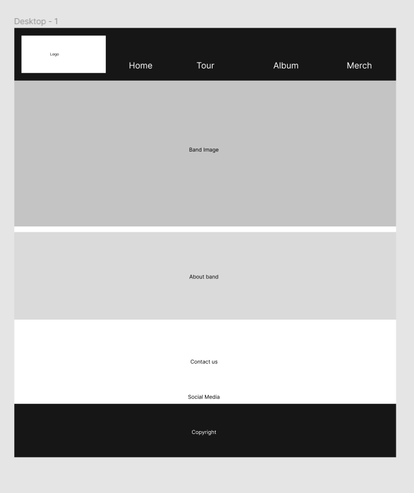
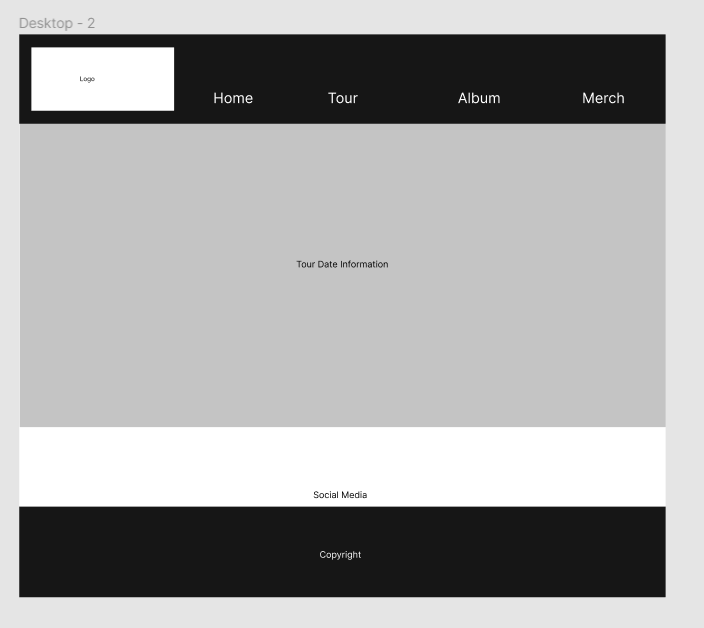
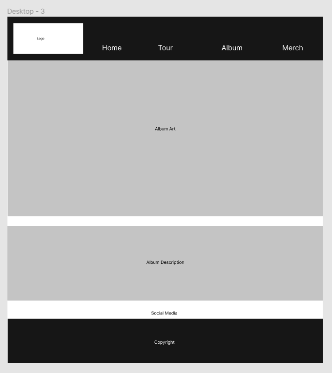
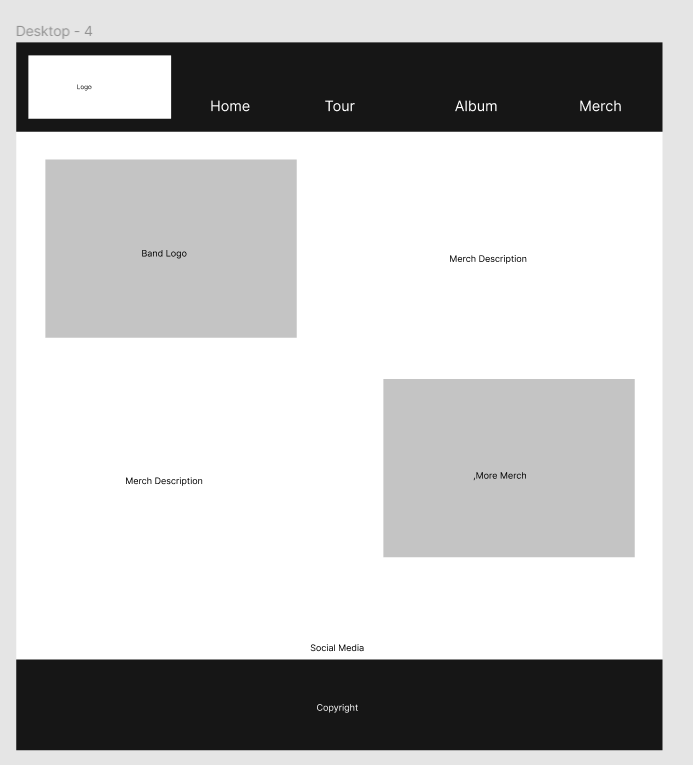

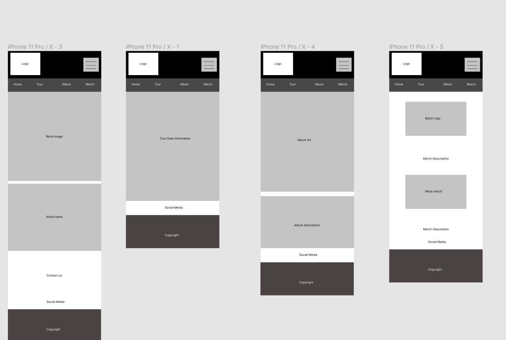 

[Back to top](<#contents>)

## Site Structure

Afterlife's website has five pages. The [home page](index.html) is the default loading page, [tour](afterlife-tour.html), [album](afterlife-album.html), [merch](afterlife-merch.html) and the [contact](afterlife-contact.html) pages are all accessible primarily from the navigation menu. There is cover text on the home image advertising the new album which also takes you to the album page. There is also an extra page with the same styling as the contact page , which you are taken to after filling out the contact form.

[Back to top](<#contents>)
## Design Choices

 * ### Typography
      The font I primarily used for the website was 'Nanum Gothic', sans-serif. I chose this font as I felt it gave a slick and professional look to the website.
      For the cover text that sits on top of the home page's main photo, I chose 'Koulen', cursive. I felt the variation in text on the initial page draws the viewers attention and stands out which is beneficial as the new album should be a focal point of the site. 

 * ### Colour Scheme
      The colour scheme eventually chosen is one based on black and orange. I started with a deep black navbar and footer. I then added the cover text with an orange border to make it stand out and pop on the home screen and eventually landed on a clean, white background color for the body.

[Back to top](<#contents>)
# Features

The Afterlife site is set up to be clear and easy to navigate. It has many features that the user would probably be familiar with, such as a navigation bar or dropdown menu. The feel of the website is meant to be straight forward and easy to find what you are looking for. 

## Existing Features  
  * ### Navigation Menu

    * Located at the top of each page, it clearly shows how to access different parts of the website. On smaller devices, the links in the navbar, scale down to a dropdown menu to retain accessiblity but reduce the screen looking cluttered. The page the user is currently on remains highlighted.

[Back to top](<#contents>)

  * ### Home Image

      * Located on the home page beneath the navigation bar. It is a picture of the band playing live. Sitting on this image is cover text promoting the new album. The cover text acts as a link to the album page which has more information and on smaller screens the cover text disappears to avoid the page being over saturated. 

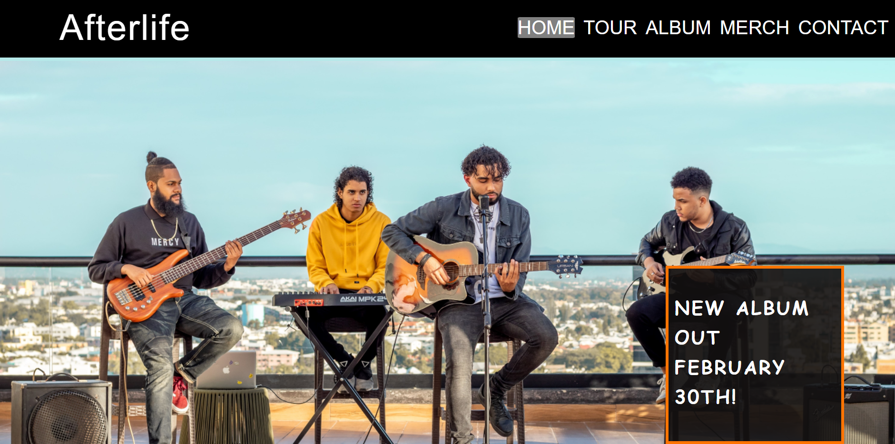
[Back to top](<#contents>)

  * ### Our background
    * The Our background section lets the user know who Afterlife are and where they come from. 
    * This section has a background image of the band standing infront of the sunset. This imagery behind the information on the bands history adds a nice sentiment to the bands background.
    * Under the background section, is the mailing list, encouraging users to keep up to date with the bands releases.

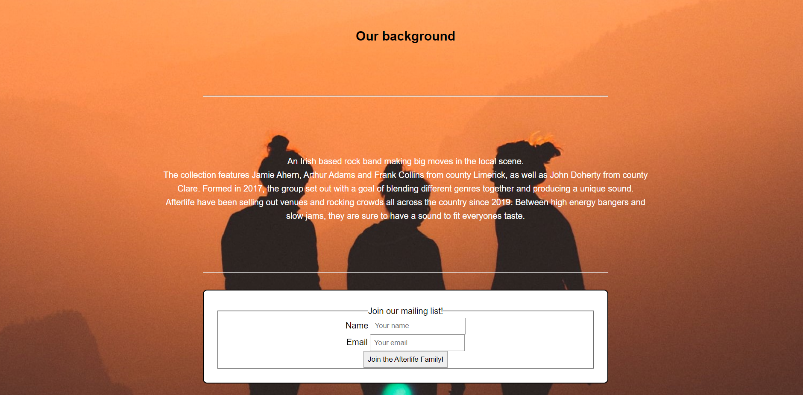
[Back to top](<#contents>)

* ### Footer
    
    * Contains social media links. To enhance the UX the links open in other tabs.
    * The social media presence will help the user keep up to date and informed about Afterlife.    

[Back to top](<#contents>)

* ### Tour

    * The tour page give the user a list of upcoming tour dates, with links to buy tickets under each date.
    * There is an image at the top of the screen showing the band playing live.
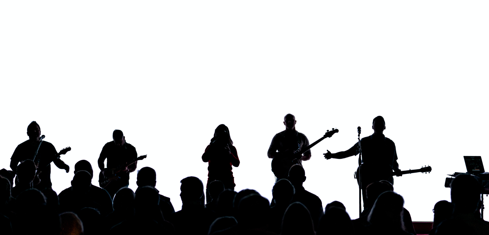
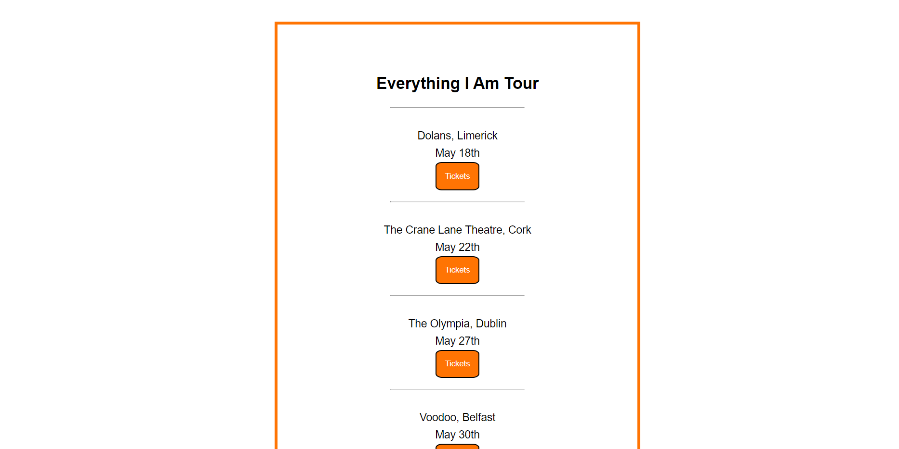
[Back to top](<#contents>)

* ### Album
    * The album page is there to showcase the upcoming and previous projects of the band. With the album art on the left , and the album description adjascent, it gives a glimpse into the inspiration and the artistic inception of each of the bands projects.

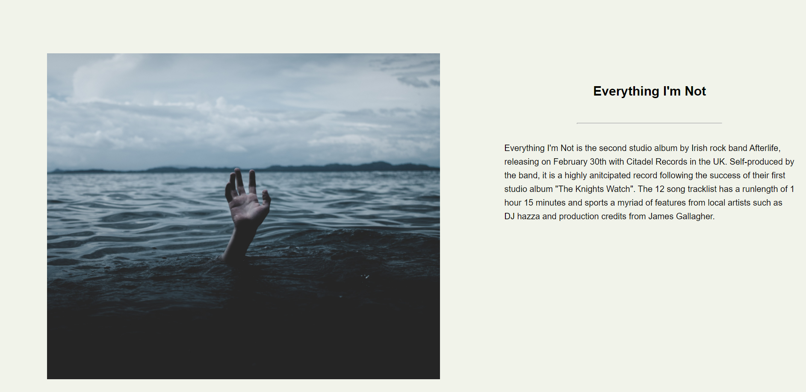
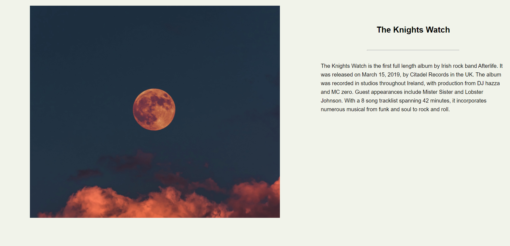
[Back to top](<#contents>)

* ### Merch

    * This section shows where you can buy merchandise to support the band. With a brief description on what the merchandise website contains, it then has a button below directing you to the merchandise site. Similarly , the image next to the description also acts as a link to the site.
    * Below this, there is a description for the jewellery partner of the band, also accompanied with links and a picture.

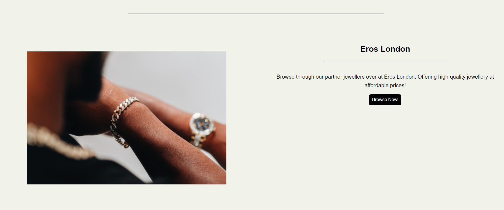
[Back to top](<#contents>)

* ### Contact 
    *The Contact page provides a chance for the user to connect with the band and ask any questions they have after navigating the information on the site. 

    *There are 3 input areas and a sumbit button on the contact form. After the form is submitted it takes the user to the submit page.

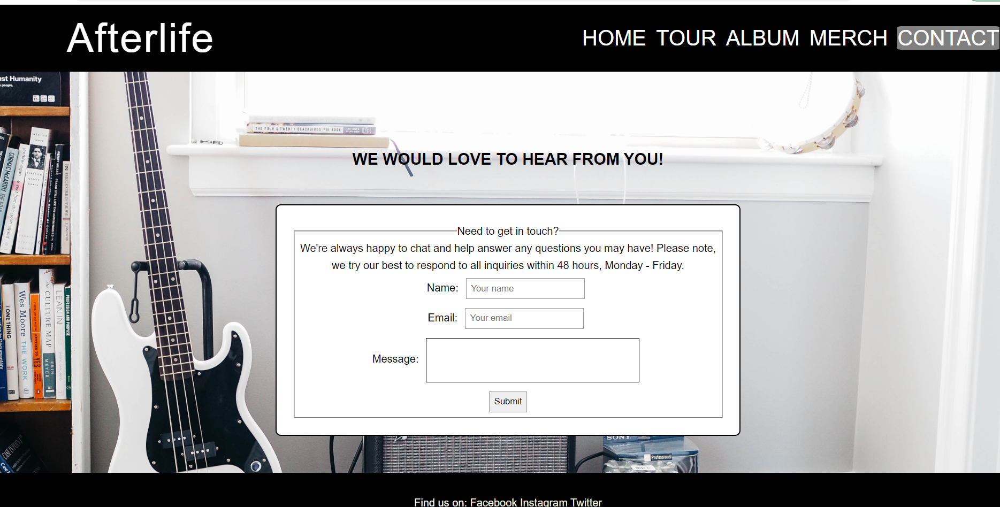

[Back to top](<#contents>)

* ### Submit page 
    * This submit page reassures the user that their question has been received and will be replied to promptly. For this project it validates the form only.
    * The Navigation bar provides easy access back to the rest of the website.

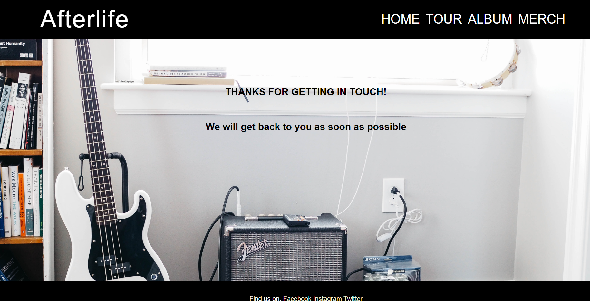

[Back to top](<#contents>)

## Future Features 

* A page where all the bands music videos would be availible for viewing on the website. This page would have a swipe feature on mobile where users could swipe from one video to another to make browsing through videos easier.

[Back to top](<#contents>)

# Technologies Used
* [HTML5](https://html.spec.whatwg.org/) - provides the content and structure for the website.
* [CSS](https://www.w3.org/Style/CSS/Overview.en.html) - provides the styling.
* [Figma](https://figma.com/) - used to create the wireframes.
* [Gitpod](https://www.gitpod.io/#get-started) - used to deploy the website.
* [Github](https://github.com/) - used to host and edit the website.

[Back to top](<#contents>)

# Testing

[Back to top](<#contents>)

# Deployment

### **To deploy the project**
The site was deployed to GitHub pages. The steps to deploy a site are as follows:
  1. In the GitHub repository, navigate to the **Settings** tab.
  2. Once in Settings, navigate to the **Pages** tab on the left hand side.
  3. Under **Source**, select the branch to **master**, then click **save**.
  4. Once the master branch has been selected, the page will be automatically refreshed with a detailed ribbon display to indicate the successful deployment.

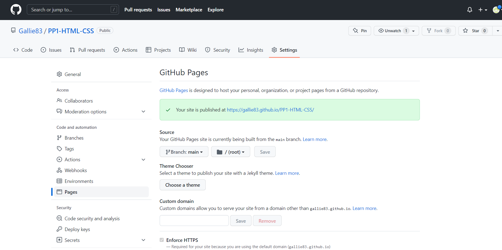

  The live link to the Github repository can be found here - https://gallie83.github.io/PP1-HTML-CSS/

### **To create a local clone of this project**
The method from cloning a project from GitHub is below:

1. Under the repository’s name, click on the **code** tab.
2. In the **Clone with HTTPS** section, click on the clipboard icon to copy the given URL.

3. In your IDE of choice, open **Git Bash**.
4. Change the current working directory to the location where you want the cloned directory to be made.
5. Type **git clone**, and then paste the URL copied from GitHub.
6. Press **enter** and the local clone will be created.

[Back to top](<#contents>)

# Credits
### Content

* The font came from [Google Fonts](https://fonts.google.com/).
* The colour palette was compiled by [Coolors](https://coolors.co/).
* The navigation bar idea came from a [YouTube tutorial](https://www.youtube.com/watch?v=oLgtucwjVII).
* The inspiration for the dropdown menu came from [W3schools](https://www.w3schools.com/howto/howto_css_dropdown_navbar.asp).
* [Figma](https://figma.com/) was used to create the wireframes.

### Media
* The photos all came from [Unsplash](https://unsplash.com/).

[Back to top](<#contents>)

# Acknowledgements
The site was completed as a Portfolio 1 Project piece for the Full Stack Software Developer Diploma at the [Code Institute](https://codeinstitute.net/). As such I would like to thank my mentor [Precious Ijege](https://www.linkedin.com/in/precious-ijege-908a00168/), the Slack community, and all at the Code Institute for their help and support.

Kevin Gallagher 2022.

[Back to top](<#contents>)